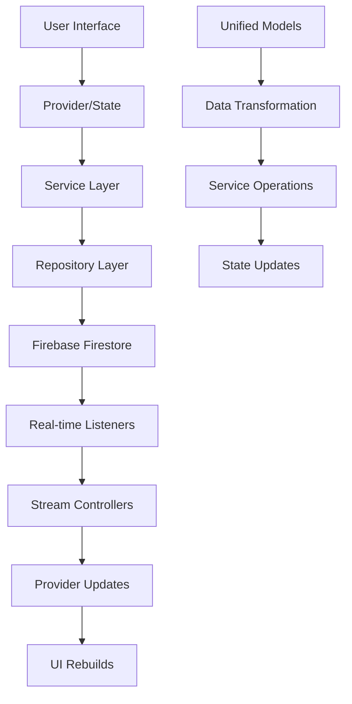
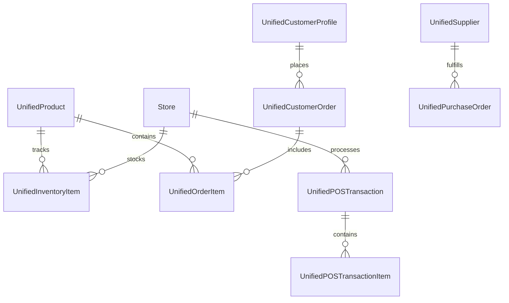

# 📚 Ravali ERP Ecosystem - Comprehensive Project Documentation

## 🏗️ Project Overview

The Ravali ERP Ecosystem is a **comprehensive, modular Enterprise Resource Planning system** built with Flutter and Firebase. The project consists of multiple interconnected applications that provide complete business management capabilities.

### 🎯 Project Structure

```
📁 copy of my software/
├── 📁 ravali_erp_ecosystem_modular/           # Main modular ERP system
│   ├── 📁 erp_admin_panel/                    # Primary admin application
│   ├── 📁 customer_app/                       # Customer-facing application
│   ├── 📁 supplier_app/                       # Supplier portal
│   └── 📁 shared_erp_package/                 # Shared models & utilities
├── 📁 ravali_software_enhanced/               # Enhanced single-app version
├── 📁 ravali_software/                        # Original single-app version
└── 📁 erp_restructured/                       # Legacy restructured version
```

---

## 🎯 Core Architecture & Design Principles

### 🔧 Technology Stack
- **Frontend**: Flutter (Web & Mobile)
- **Backend**: Firebase (Firestore, Auth, Functions)
- **State Management**: Riverpod + Provider
- **Architecture**: Modular, Clean Architecture
- **Database**: Cloud Firestore with real-time sync

### 🏗️ Design Patterns
1. **Modular Architecture**: Each business domain is a separate module
2. **Unified Data Models**: Centralized, consistent data structures
3. **Service-Provider Pattern**: Business logic separated from UI
4. **Repository Pattern**: Data access abstraction
5. **Observer Pattern**: Real-time data synchronization

---

## 📱 Applications Overview

### 1. 🏢 ERP Admin Panel (`erp_admin_panel/`)
**Purpose**: Primary business management interface for administrators and staff

**Key Features**:
- Multi-module dashboard
- Real-time inventory management
- Customer order processing
- POS system integration
- Supplier management
- Analytics and reporting
- User management with RBAC
- Store management (multi-location support)

**Target Users**: Business owners, managers, staff, accountants

### 2. 🛍️ Customer App (`customer_app/`)
**Purpose**: Customer-facing mobile and web application

**Key Features**:
- Product catalog browsing
- Shopping cart and checkout
- Order tracking
- Customer profile management
- Support tickets
- Notifications

**Target Users**: End customers, clients

### 3. 🏭 Supplier App (`supplier_app/`)
**Purpose**: Supplier portal for inventory and order management

**Key Features**:
- Product catalog management
- Purchase order tracking
- Inventory updates
- Communication tools
- Performance analytics

**Target Users**: Suppliers, vendors, distributors

### 4. 📦 Shared ERP Package (`shared_erp_package/`)
**Purpose**: Common models, utilities, and services shared across all apps

**Contents**:
- Unified data models
- Common utilities
- Shared services
- Authentication helpers

---

## 🗂️ ERP Admin Panel - Detailed File Structure

### 📁 `/lib/` - Main Application Code

```
lib/
├── 🎯 main.dart                              # Application entry point
├── ⚙️ firebase_options.dart                  # Firebase configuration
├── 🔧 app_services.dart                      # Core service definitions
├── 
├── 📁 core/                                  # Core application logic
│   ├── 📁 models/
│   │   └── 📄 unified_models.dart            # ⭐ Unified data models
│   ├── 📁 services/
│   │   ├── 📄 core_services.dart             # Core business services
│   │   └── 📄 role_based_access_service.dart # RBAC implementation
│   └── 📁 utils/
│       └── 📄 constants.dart                 # Application constants
│
├── 📁 modules/                               # ⭐ Modular business domains
│   ├── 📁 analytics/                         # Business intelligence
│   ├── 📁 crm/                              # Customer relationship management
│   ├── 📁 customer_order_management/         # Order processing
│   ├── 📁 inventory_management/              # Stock management
│   ├── 📁 pos_management/                    # Point of sale
│   ├── 📁 product_management/                # Product catalog
│   ├── 📁 purchase_order_management/         # Procurement
│   ├── 📁 store_management/                  # Multi-location support
│   ├── 📁 supplier_management/               # Vendor management
│   └── 📁 user_management/                   # User admin & RBAC
│
├── 📁 providers/                             # State management
│   ├── 📄 pos_provider.dart                 # POS state management
│   ├── 📄 app_state_provider.dart           # Global app state
│   └── 📄 service_providers.dart            # Service provider exports
│
├── 📁 screens/                               # Legacy screens (being modularized)
│   ├── 📄 unified_dashboard_screen.dart      # Main dashboard
│   ├── 📄 customer_app_screen.dart          # Customer app integration
│   └── 📄 supplier_portal_screen.dart       # Supplier portal integration
│
└── 📁 tool/                                 # Development & testing tools
    ├── 📄 admin_mock_data_widget.dart       # Mock data generator UI
    ├── 📄 store_mock_data_generator.dart    # Store data generator
    └── 📄 unified_erp_mock_data_generator.dart # Unified mock data
```

---

## 🔀 Module Architecture Deep Dive

Each module follows a consistent structure:

```
📁 [module_name]/
├── 📁 models/                                # Module-specific models
│   └── 📄 [module]_models.dart              
├── 📁 services/                              # Business logic services
│   ├── 📄 [module]_service.dart             # Main service
│   └── 📄 [module]_repository.dart          # Data access
├── 📁 screens/                               # UI screens
│   ├── 📄 [module]_module_screen.dart       # Main module screen
│   ├── 📄 [module]_list_screen.dart         # List view
│   ├── 📄 [module]_form_screen.dart         # Create/edit form
│   └── 📄 [module]_detail_screen.dart       # Detail view
├── 📁 widgets/                               # Reusable UI components
│   ├── 📄 [module]_card.dart                
│   └── 📄 [module]_form_fields.dart         
└── 📁 tool/                                 # Module-specific tools
    └── 📄 [module]_mock_data.dart           
```

### 🏪 Example: POS Management Module

```
📁 pos_management/
├── 📁 services/
│   ├── 📄 pos_service.dart                   # POS transaction logic
│   └── 📄 receipt_service.dart              # Receipt generation
├── 📁 screens/
│   ├── 📄 pos_module_screen.dart            # Main POS interface
│   ├── 📄 add_edit_pos_transaction_screen.dart # Transaction form
│   └── 📄 pos_analytics_screen.dart         # POS analytics
├── 📁 widgets/
│   ├── 📄 pos_transaction_card.dart         # Transaction display
│   ├── 📄 pos_payment_widget.dart          # Payment processing
│   └── 📄 pos_receipt_widget.dart          # Receipt display
└── 📁 tool/
    └── 📄 pos_mock_data.dart                # POS test data
```

---

## 📊 Data Flow Architecture

### 🔄 Data Flow Diagram



### 🎯 Core Data Flow Process

1. **User Interaction** → UI triggers action
2. **Provider/State** → Calls appropriate service
3. **Service Layer** → Processes business logic
4. **Repository Layer** → Handles data persistence
5. **Firebase** → Stores/retrieves data
6. **Real-time Sync** → Updates all connected clients
7. **UI Update** → Reflects changes automatically

---

## 📋 Unified Models System

### 🎯 Core Philosophy
The **Unified Models** system replaces fragmented, inconsistent data models throughout the codebase with a single source of truth.

### 📄 Key Unified Models (`/core/models/unified_models.dart`)

#### 1. 🏷️ UnifiedProduct
```dart
class UnifiedProduct {
  final String id;
  final String name;
  final String code;
  final double costPrice;
  final double salePrice;
  final bool trackInventory;
  final int? currentStock;
  // ... other fields
}
```
**Usage**: Product catalog, inventory, POS transactions, orders

#### 2. 🛍️ UnifiedCustomerOrder
```dart
class UnifiedCustomerOrder {
  final String id;
  final String customerId;
  final List<UnifiedOrderItem> items;
  final double totalAmount;
  final OrderStatus status;
  final DateTime orderDate;
  // ... other fields
}
```
**Usage**: Customer orders, order tracking, sales analytics

#### 3. 💳 UnifiedPOSTransaction
```dart
class UnifiedPOSTransaction {
  final String id;
  final String storeId;
  final List<UnifiedPOSTransactionItem> items;
  final double totalAmount;
  final PaymentMethod paymentMethod;
  final DateTime timestamp;
  // ... other fields
}
```
**Usage**: POS system, sales tracking, inventory updates

#### 4. 📦 UnifiedInventoryItem
```dart
class UnifiedInventoryItem {
  final String id;
  final String productId;
  final String storeId;
  final int currentStock;
  final int minStockLevel;
  final double averageCost;
  final DateTime lastUpdated;
  // ... other fields
}
```
**Usage**: Inventory management, stock tracking, reorder alerts

#### 5. 👤 UnifiedCustomerProfile
```dart
class UnifiedCustomerProfile {
  final String id;
  final String name;
  final String email;
  final String mobileNumber;
  final String loyaltyTier;
  final double totalSpent;
  final List<String> addresses;
  // ... other fields
}
```
**Usage**: CRM, customer analytics, loyalty programs

---

## 🔧 Service Architecture

### 🎯 Service Hierarchy

```
📊 Service Layer Architecture
├── 🔧 Core Services (Shared)
│   ├── CacheService              # Data caching
│   ├── ValidationService         # Input validation
│   └── AuditService             # Activity logging
│
├── 📊 Business Services (Module-specific)
│   ├── ProductService           # Product management
│   ├── InventoryService         # Stock management
│   ├── POSService              # POS operations
│   ├── CustomerOrderService     # Order processing
│   ├── CustomerProfileService   # CRM operations
│   ├── SupplierService         # Vendor management
│   └── UserProfileService      # User management
│
└── 🔌 Integration Services
    ├── FirebaseService          # Database operations
    ├── AuthService             # Authentication
    └── NotificationService     # Push notifications
```

### 🔄 Service Communication Pattern

```dart
// Example: Creating a customer order
1. UI calls → CustomerOrderService.createOrder()
2. Service validates → ValidationService.validateOrder()
3. Service updates inventory → InventoryService.updateStock()
4. Service logs activity → AuditService.logOrderCreation()
5. Service saves to DB → FirebaseService.saveOrder()
6. Real-time sync → All connected clients receive update
```

---

## 🎛️ Provider (State Management) System

### 🔧 Riverpod + Provider Hybrid Approach

The project uses a **hybrid state management** approach:
- **Riverpod**: For global app state and service injection
- **Provider**: For UI-specific state and legacy compatibility

### 📊 Provider Structure

```dart
// Global App Providers (Riverpod)
final cacheServiceProvider = Provider<CacheService>((ref) => CacheService());
final productServiceProvider = Provider<ProductService>((ref) => 
  ProductService(ref.watch(cacheServiceProvider)));

// UI State Providers (Provider package)
class PosProvider extends ChangeNotifier {
  List<UnifiedPOSTransaction> _transactions = [];
  UnifiedPOSTransaction? _currentTransaction;
  
  void addTransaction(UnifiedPOSTransaction transaction) {
    _transactions.add(transaction);
    notifyListeners();
  }
}
```

### 🔄 State Flow Example

```
User Action (Add to Cart)
    ↓
UI Widget calls Provider method
    ↓
Provider calls Service
    ↓
Service processes business logic
    ↓
Service updates Firestore
    ↓
Firestore triggers real-time listener
    ↓
Provider receives update
    ↓
Provider notifies UI
    ↓
UI rebuilds with new data
```

---

## 🚀 Application Flow & Navigation

### 🎯 Main Application Entry Point (`main.dart`)

```dart
Future<void> main() async {
  // 1. Initialize Flutter bindings
  WidgetsFlutterBinding.ensureInitialized();
  
  // 2. Initialize Firebase
  await getOrInitializeFirebase();
  
  // 3. Initialize RBAC system
  await RoleBasedAccessService.instance.initializeDefaultUsers();
  
  // 4. Generate mock data for demo
  await generateMockData();
  
  // 5. Start application with ProviderScope
  runApp(ProviderScope(child: const MyApp()));
}
```

### 🗺️ Navigation Flow

```
🏠 ModulesHomePage (Main Dashboard)
├── 📊 Dashboard → UnifiedDashboardScreen
├── 📦 Product Management → ProductManagementDashboard
├── 📋 Inventory → InventoryManagementScreen
├── 🏪 Store Management → StoreManagementDashboard
├── 👥 Supplier Management → SupplierModuleScreen
├── 📋 Purchase Orders → PurchaseOrderModuleScreen
├── 🛍️ Customer Orders → CustomerOrderModuleScreen
├── 👤 CRM → CustomerProfileModuleScreen
├── 💳 POS System → PosModuleScreen
├── 👥 User Management → UserManagementModuleScreen
├── 🛍️ Customer App → CustomerAppScreen
└── 🏭 Supplier Portal → SupplierPortalScreen
```

### 🔄 Module Navigation Pattern

Each module follows a consistent navigation pattern:

```
Module Entry Screen
├── List View (Browse all items)
├── Detail View (View single item)
├── Form View (Create/Edit item)
└── Analytics View (Module-specific insights)
```

---

## 📊 Database Schema & Firestore Collections

### 🗄️ Firestore Collections Structure

```
🔥 Firestore Database
├── 📁 products/                    # Product catalog
│   └── 📄 {productId}              # UnifiedProduct documents
├── 📁 inventory/                   # Inventory tracking
│   └── 📄 {storeId}_{productId}    # UnifiedInventoryItem documents
├── 📁 customer_orders/             # Customer orders
│   └── 📄 {orderId}                # UnifiedCustomerOrder documents
├── 📁 pos_transactions/            # POS sales
│   └── 📄 {transactionId}          # UnifiedPOSTransaction documents
├── 📁 customer_profiles/           # Customer data
│   └── 📄 {customerId}             # UnifiedCustomerProfile documents
├── 📁 suppliers/                   # Supplier information
│   └── 📄 {supplierId}             # UnifiedSupplier documents
├── 📁 purchase_orders/             # Procurement
│   └── 📄 {poId}                   # UnifiedPurchaseOrder documents
├── 📁 stores/                      # Store locations
│   └── 📄 {storeId}                # Store documents
├── 📁 users/                       # User management
│   └── 📄 {userId}                 # UserProfile documents
└── 📁 audit_logs/                  # Activity tracking
    └── 📄 {logId}                  # Audit trail documents
```

### 🔗 Data Relationships



---

## 🔐 Security & Role-Based Access Control (RBAC)

### 👥 User Roles & Permissions

```
🔐 RBAC System
├── 👑 Super Admin
│   ├── Full system access
│   ├── User management
│   └── System configuration
├── 🏢 Store Manager
│   ├── Store operations
│   ├── Staff management
│   └── Local reporting
├── 👤 Staff
│   ├── POS operations
│   ├── Inventory updates
│   └── Customer service
├── 📊 Accountant
│   ├── Financial reports
│   ├── Transaction review
│   └── Audit access
└── 👀 Viewer
    ├── Read-only access
    └── Basic reporting
```

### 🛡️ Security Implementation

```dart
// RBAC Service Example
class RoleBasedAccessService {
  Future<bool> hasPermission(String userId, String permission) async {
    final user = await getUserProfile(userId);
    final role = await getRole(user.roleId);
    return role.permissions.contains(permission);
  }
  
  Future<void> enforcePermission(String permission) async {
    if (!await hasPermission(currentUser.id, permission)) {
      throw UnauthorizedException('Access denied');
    }
  }
}
```

---

## 🔧 Development Tools & Utilities

### 🛠️ Mock Data Generation

The project includes comprehensive mock data generators for testing:

```
📁 tool/
├── 📄 admin_mock_data_widget.dart          # UI for generating test data
├── 📄 store_mock_data_generator.dart       # Store and location data
└── 📄 unified_erp_mock_data_generator.dart # Comprehensive ERP data
```

### 🎯 Mock Data Features
- **Products**: 50+ sample products with realistic data
- **Customers**: Diverse customer profiles with purchase history
- **Transactions**: Realistic POS and order transactions
- **Inventory**: Stock levels across multiple stores
- **Users**: Sample users with different roles

### 🔍 Development Commands

```bash
# Build for web
flutter build web

# Run in development mode
flutter run -d chrome --web-port 8080

# Generate mock data
# Use the AdminMockDataWidget in the app

# Analyze code
flutter analyze

# Run tests
flutter test
```

---

## 🚀 Deployment & Production

### 🌐 Web Deployment
The application is optimized for web deployment with:
- Progressive Web App (PWA) support
- Responsive design for all screen sizes
- Offline capabilities for core features
- Firebase Hosting integration

### 📱 Mobile Deployment
Future mobile deployment includes:
- Android APK/AAB builds
- iOS IPA builds
- Platform-specific optimizations

### ☁️ Firebase Configuration
```dart
// Firebase services used:
- Firestore: Database
- Authentication: User management
- Hosting: Web deployment
- Functions: Server-side logic
- Storage: File uploads
```

---

## 🔄 Module Communication & Integration

### 📡 Inter-Module Communication

Modules communicate through:

1. **Shared Services**: Common business logic
2. **Unified Models**: Consistent data structures
3. **Event System**: Pub/Sub for loose coupling
4. **Provider System**: Reactive state updates

### 🔗 Integration Points

```dart
// Example: Order processing affecting multiple modules
CustomerOrderService.createOrder() 
  ↓
InventoryService.updateStock()      // Reduce inventory
  ↓
CustomerProfileService.updateSpent() // Update customer total
  ↓
AuditService.logTransaction()       // Track activity
  ↓
NotificationService.notifyStaff()   // Alert relevant staff
```

---

## 🐛 Error Handling & Debugging

### 🔍 Error Tracking System

```dart
class ErrorHandler {
  static void handleError(Object error, StackTrace stackTrace) {
    // Log to console
    debugPrint('Error: $error');
    
    // Log to Firestore for tracking
    FirebaseFirestore.instance.collection('error_logs').add({
      'error': error.toString(),
      'stackTrace': stackTrace.toString(),
      'timestamp': FieldValue.serverTimestamp(),
    });
    
    // Show user-friendly message
    showErrorSnackBar('An error occurred. Please try again.');
  }
}
```

### 🛠️ Debugging Tools

1. **Flutter Inspector**: UI debugging
2. **Firebase Console**: Database inspection
3. **Chrome DevTools**: Performance analysis
4. **Mock Data Widget**: Test data generation
5. **Error Logs Collection**: Production error tracking

---

## 📈 Performance Optimizations

### ⚡ Performance Features

1. **Data Caching**: Reduce Firestore reads
2. **Lazy Loading**: Load data on demand
3. **Stream Optimization**: Efficient real-time updates
4. **Image Optimization**: Compressed assets
5. **Code Splitting**: Modular loading

### 📊 Performance Monitoring

```dart
// Performance tracking
class PerformanceMonitor {
  static void trackOperation(String operation, Function() callback) {
    final stopwatch = Stopwatch()..start();
    
    try {
      callback();
    } finally {
      stopwatch.stop();
      _logPerformance(operation, stopwatch.elapsedMilliseconds);
    }
  }
}
```

---

## 🔮 Future Enhancements

### 🎯 Planned Features

1. **Advanced Analytics**: Business intelligence dashboards
2. **Mobile Apps**: Native iOS/Android applications
3. **API Integration**: Third-party service connections
4. **Machine Learning**: Predictive analytics
5. **Multi-language Support**: Internationalization
6. **Advanced Reporting**: Custom report builder
7. **Workflow Automation**: Business process automation

### 🔧 Technical Improvements

1. **Microservices Architecture**: Service decomposition
2. **GraphQL API**: Efficient data fetching
3. **Real-time Collaboration**: Multi-user editing
4. **Advanced Caching**: Redis integration
5. **Kubernetes Deployment**: Container orchestration

---

## 📞 Support & Maintenance

### 🛠️ Maintenance Tasks

- **Daily**: Monitor error logs and performance
- **Weekly**: Update dependencies and security patches
- **Monthly**: Performance optimization and cleanup
- **Quarterly**: Feature updates and user feedback integration

### 📧 Support Channels

- **Technical Issues**: Review error logs in Firebase Console
- **Feature Requests**: Document in project issues
- **Performance Issues**: Use Flutter DevTools for analysis

---

## 🎓 Getting Started Guide

### 🚀 Quick Start

1. **Clone Repository**
```bash
git clone [repository-url]
cd ravali_erp_ecosystem_modular/erp_admin_panel
```

2. **Install Dependencies**
```bash
flutter pub get
```

3. **Configure Firebase**
```bash
# Update firebase_options.dart with your project config
```

4. **Run Application**
```bash
flutter run -d chrome --web-port 8080
```

5. **Generate Test Data**
```bash
# Use AdminMockDataWidget in the application
```

### 📚 Learning Path

1. **Understand Architecture**: Review this documentation
2. **Explore Modules**: Start with product_management
3. **Study Unified Models**: Review unified_models.dart
4. **Understand Services**: Explore service layer
5. **Practice with Mock Data**: Use mock data generators
6. **Build Features**: Create new modules following patterns

---

## 📋 File Reference Quick Guide

### 🎯 Essential Files

| File | Purpose | Priority |
|------|---------|----------|
| `main.dart` | Application entry point | ⭐⭐⭐ |
| `core/models/unified_models.dart` | Central data models | ⭐⭐⭐ |
| `app_services.dart` | Service definitions | ⭐⭐⭐ |
| `services/core_services.dart` | Core business logic | ⭐⭐⭐ |
| `providers/pos_provider.dart` | POS state management | ⭐⭐ |
| `modules/*/screens/*.dart` | UI screens | ⭐⭐ |
| `tool/admin_mock_data_widget.dart` | Testing tools | ⭐ |

### 🔍 Module File Patterns

```
Each module follows this pattern:
- [module]_service.dart      # Business logic
- [module]_module_screen.dart # Main UI
- [module]_models.dart       # Data models (if needed)
- [module]_mock_data.dart    # Test data
```

---

This documentation provides a comprehensive overview of the Ravali ERP Ecosystem. The modular architecture ensures scalability, maintainability, and clear separation of concerns while the unified models system provides consistency across the entire application.
