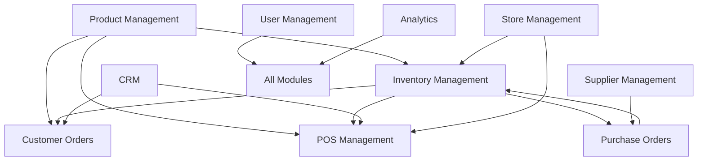

# 📁 Ravali ERP - Module-by-Module Detailed Breakdown

## 🎯 Complete Module Analysis & File Function Reference

---

## 📦 1. Product Management Module

### 📁 File Structure
```
modules/product_management/
├── 📁 screens/
│   ├── 📄 product_management_dashboard.dart     # Main product overview
│   └── 📄 store_aware_product_screen.dart      # Multi-store product view
├── 📁 services/
│   ├── 📄 product_service.dart                 # Product CRUD operations
│   └── 📄 product_analytics_service.dart       # Product insights
├── 📁 widgets/
│   ├── 📄 product_card.dart                    # Product display card
│   ├── 📄 product_form.dart                    # Product create/edit form
│   └── 📄 product_search.dart                  # Product search widget
└── 📁 tool/
    └── 📄 product_mock_data.dart               # Product test data
```

### 🔧 Key Functions

#### `product_management_dashboard.dart`
- **Purpose**: Central hub for product management
- **Key Features**:
  - Product catalog overview
  - Quick actions (Add, Edit, Delete)
  - Category-wise product grouping
  - Search and filter functionality
  - Product performance metrics

#### `store_aware_product_screen.dart`
- **Purpose**: Multi-location product management
- **Key Features**:
  - Store-specific product views
  - Cross-store inventory visibility
  - Store-specific pricing
  - Location-based product availability

#### `product_service.dart`
- **Key Methods**:
  ```dart
  Future<List<UnifiedProduct>> getAllProducts()
  Future<UnifiedProduct> getProductById(String id)
  Future<String> createProduct(UnifiedProduct product)
  Future<void> updateProduct(String id, UnifiedProduct product)
  Future<void> deleteProduct(String id)
  Stream<List<UnifiedProduct>> getProductsStream()
  ```

### 🔄 Data Flow
```
UI Request → ProductService → UnifiedProduct Model → Firebase → Real-time Updates
```

---

## 📋 2. Inventory Management Module

### 📁 File Structure
```
modules/inventory_management/
├── 📁 screens/
│   ├── 📄 inventory_management_screen.dart     # Main inventory dashboard
│   ├── 📄 add_edit_inventory_screen.dart      # Inventory form
│   ├── 📄 inventory_list_screen.dart          # Inventory listing
│   └── 📄 inventory_test_screen.dart          # Testing interface
├── 📁 services/
│   ├── 📄 inventory_service.dart              # Inventory operations
│   └── 📄 stock_alert_service.dart           # Low stock alerts
├── 📁 widgets/
│   ├── 📄 inventory_card.dart                 # Inventory display
│   ├── 📄 stock_level_indicator.dart         # Visual stock levels
│   └── 📄 reorder_alert.dart                 # Reorder notifications
└── 📁 tool/
    └── 📄 inventory_mock_data.dart            # Inventory test data
```

### 🔧 Key Functions

#### `inventory_management_screen.dart`
- **Purpose**: Central inventory control
- **Key Features**:
  - Real-time stock levels
  - Low stock alerts
  - Multi-store inventory view
  - Stock movement tracking
  - Inventory analytics

#### `inventory_service.dart`
- **Key Methods**:
  ```dart
  Future<List<UnifiedInventoryItem>> getAllInventory()
  Future<void> updateStock(String productId, int quantity)
  Future<void> transferStock(String from, String to, int quantity)
  Stream<List<UnifiedInventoryItem>> getLowStockItems()
  Future<void> adjustStock(String productId, int adjustment, String reason)
  ```

### 🔄 Stock Movement Flow
```
Product Sale → POS System → Inventory Update → Stock Level Check → Alert if Low → Reorder Suggestion
```

---

## 💳 3. POS Management Module

### 📁 File Structure
```
modules/pos_management/
├── 📁 screens/
│   ├── 📄 pos_module_screen.dart              # Main POS interface
│   ├── 📄 add_edit_pos_transaction_screen.dart # Transaction form
│   └── 📄 pos_analytics_screen.dart           # Sales analytics
├── 📁 services/
│   ├── 📄 pos_service.dart                    # POS operations
│   ├── 📄 receipt_service.dart               # Receipt generation
│   └── 📄 payment_service.dart               # Payment processing
├── 📁 widgets/
│   ├── 📄 pos_transaction_card.dart          # Transaction display
│   ├── 📄 pos_payment_widget.dart           # Payment interface
│   ├── 📄 pos_receipt_widget.dart           # Receipt display
│   └── 📄 pos_product_selector.dart         # Product selection
└── 📁 tool/
    └── 📄 pos_mock_data.dart                 # POS test data
```

### 🔧 Key Functions

#### `pos_module_screen.dart`
- **Purpose**: Point of sale operations
- **Key Features**:
  - Product selection interface
  - Real-time price calculation
  - Multiple payment methods
  - Receipt generation
  - Transaction history

#### `pos_service.dart`
- **Key Methods**:
  ```dart
  Future<String> createTransaction(UnifiedPOSTransaction transaction)
  Future<List<UnifiedPOSTransaction>> getTransactions()
  Future<void> processPayment(String transactionId, PaymentDetails payment)
  Future<String> generateReceipt(String transactionId)
  Stream<List<UnifiedPOSTransaction>> getTransactionsStream()
  ```

### 🔄 POS Transaction Flow
```
Product Selection → Calculate Total → Payment Processing → Inventory Update → Receipt Generation → Transaction Complete
```

---

## 🛍️ 4. Customer Order Management Module

### 📁 File Structure
```
modules/customer_order_management/
├── 📁 screens/
│   ├── 📄 customer_order_module_screen.dart   # Order dashboard
│   ├── 📄 customer_order_form_screen.dart     # Order creation form
│   ├── 📄 order_list_screen.dart             # Order listing
│   └── 📄 order_detail_screen.dart           # Order details
├── 📁 services/
│   ├── 📄 customer_order_service.dart        # Order operations
│   ├── 📄 order_fulfillment_service.dart     # Order fulfillment
│   └── 📄 order_analytics_service.dart       # Order insights
├── 📁 widgets/
│   ├── 📄 order_card.dart                    # Order display card
│   ├── 📄 order_status_widget.dart          # Status tracking
│   └── 📄 order_timeline.dart               # Order progress
└── 📁 tool/
    └── 📄 order_mock_data.dart               # Order test data
```

### 🔧 Key Functions

#### `customer_order_module_screen.dart`
- **Purpose**: Order management hub
- **Key Features**:
  - Order status overview
  - Order processing workflow
  - Customer communication
  - Fulfillment tracking
  - Order analytics

#### `customer_order_service.dart`
- **Key Methods**:
  ```dart
  Future<String> createOrder(UnifiedCustomerOrder order)
  Future<List<UnifiedCustomerOrder>> getOrdersByStatus(OrderStatus status)
  Future<void> updateOrderStatus(String orderId, OrderStatus status)
  Future<void> processOrder(String orderId)
  Stream<List<UnifiedCustomerOrder>> getOrdersStream()
  ```

### 🔄 Order Processing Flow
```
Order Created → Inventory Check → Payment Processing → Order Confirmation → Fulfillment → Shipping → Delivery → Complete
```

---

## 👤 5. CRM (Customer Relationship Management) Module

### 📁 File Structure
```
modules/crm/
├── 📁 screens/
│   ├── 📄 customer_profile_module_screen.dart # CRM dashboard
│   ├── 📄 customer_form_screen.dart          # Customer form
│   ├── 📄 customer_list_screen.dart          # Customer listing
│   └── 📄 customer_analytics_screen.dart     # Customer insights
├── 📁 services/
│   ├── 📄 customer_profile_service.dart      # Customer operations
│   ├── 📄 loyalty_service.dart              # Loyalty program
│   └── 📄 customer_analytics_service.dart    # Customer insights
├── 📁 widgets/
│   ├── 📄 customer_card.dart                # Customer display
│   ├── 📄 loyalty_badge.dart                # Loyalty status
│   └── 📄 customer_timeline.dart            # Customer history
└── 📁 tool/
    └── 📄 customer_mock_data.dart            # Customer test data
```

### 🔧 Key Functions

#### `customer_profile_module_screen.dart`
- **Purpose**: Customer relationship management
- **Key Features**:
  - Customer profile management
  - Purchase history tracking
  - Loyalty program management
  - Customer segmentation
  - Communication history

#### `customer_profile_service.dart`
- **Key Methods**:
  ```dart
  Future<String> createProfile(UnifiedCustomerProfile profile)
  Future<UnifiedCustomerProfile?> getProfile(String profileId)
  Future<List<UnifiedCustomerProfile>> searchByMobile(String mobile)
  Future<List<UnifiedCustomerProfile>> getTopCustomers(int limit)
  Future<void> updateLoyaltyTier(String customerId, String tier)
  ```

---

## 👥 6. Supplier Management Module

### 📁 File Structure
```
modules/supplier_management/
├── 📁 screens/
│   ├── 📄 supplier_module_screen.dart        # Supplier dashboard
│   ├── 📄 supplier_form_screen.dart          # Supplier form
│   ├── 📄 supplier_list_screen.dart          # Supplier listing
│   └── 📄 supplier_performance_screen.dart   # Performance metrics
├── 📁 services/
│   ├── 📄 supplier_service.dart              # Supplier operations
│   ├── 📄 supplier_evaluation_service.dart   # Performance evaluation
│   └── 📄 supplier_communication_service.dart # Communication tools
├── 📁 widgets/
│   ├── 📄 supplier_card.dart                 # Supplier display
│   ├── 📄 performance_indicator.dart         # Performance metrics
│   └── 📄 supplier_contact_widget.dart       # Contact information
└── 📁 tool/
    └── 📄 supplier_mock_data.dart             # Supplier test data
```

### 🔧 Key Functions

#### `supplier_module_screen.dart`
- **Purpose**: Supplier relationship management
- **Key Features**:
  - Supplier database management
  - Performance tracking
  - Contract management
  - Communication tools
  - Supplier analytics

---

## 📋 7. Purchase Order Management Module

### 📁 File Structure
```
modules/purchase_order_management/
├── 📁 screens/
│   ├── 📄 purchase_order_module_screen.dart  # PO dashboard
│   ├── 📄 purchase_order_form_screen.dart    # PO creation form
│   ├── 📄 purchase_order_detail_screen.dart  # PO details
│   └── 📄 purchase_order_list_screen.dart    # PO listing
├── 📁 services/
│   ├── 📄 purchase_order_service.dart        # PO operations
│   ├── 📄 approval_workflow_service.dart     # Approval process
│   └── 📄 receiving_service.dart             # Goods receiving
├── 📁 widgets/
│   ├── 📄 po_communication_tab.dart          # Communication tools
│   ├── 📄 approval_workflow_widget.dart      # Approval interface
│   └── 📄 receiving_widget.dart              # Goods receiving
└── 📁 tool/
    └── 📄 po_mock_data.dart                  # PO test data
```

### 🔧 Key Functions

#### `purchase_order_module_screen.dart`
- **Purpose**: Procurement management
- **Key Features**:
  - Purchase order creation
  - Approval workflows
  - Supplier communication
  - Goods receiving
  - Cost tracking

---

## 🏪 8. Store Management Module

### 📁 File Structure
```
modules/store_management/
├── 📁 screens/
│   ├── 📄 store_management_dashboard.dart    # Store overview
│   ├── 📄 store_form_screen.dart            # Store configuration
│   ├── 📄 store_transfers_screen.dart       # Inter-store transfers
│   └── 📄 view_stores_screen.dart           # Store listing
├── 📁 services/
│   ├── 📄 store_service.dart                # Store operations
│   ├── 📄 transfer_service.dart             # Transfer management
│   └── 📄 store_analytics_service.dart      # Store performance
├── 📁 widgets/
│   ├── 📄 store_card.dart                   # Store display
│   ├── 📄 transfer_widget.dart              # Transfer interface
│   └── 📄 store_metrics_widget.dart         # Performance metrics
└── 📁 tool/
    └── 📄 store_mock_data.dart               # Store test data
```

### 🔧 Key Functions

#### `store_management_dashboard.dart`
- **Purpose**: Multi-location management
- **Key Features**:
  - Store configuration
  - Inter-store transfers
  - Performance comparison
  - Centralized monitoring
  - Location-based analytics

---

## 👥 9. User Management Module

### 📁 File Structure
```
modules/user_management/
├── 📁 screens/
│   ├── 📄 user_management_module_screen.dart # User dashboard
│   ├── 📄 user_form_screen.dart             # User form
│   ├── 📄 user_list_screen.dart             # User listing
│   ├── 📄 role_matrix_screen.dart           # Role management
│   └── 📄 audit_trail_screen.dart           # Activity audit
├── 📁 services/
│   ├── 📄 user_service.dart                 # User operations
│   ├── 📄 rbac_service.dart                 # Role-based access
│   └── 📄 audit_service.dart                # Activity tracking
├── 📁 widgets/
│   ├── 📄 user_card.dart                    # User display
│   ├── 📄 role_selector.dart                # Role selection
│   └── 📄 permission_matrix.dart            # Permission grid
└── 📁 tool/
    └── 📄 user_mock_data.dart                # User test data
```

### 🔧 Key Functions

#### `user_management_module_screen.dart`
- **Purpose**: User administration and security
- **Key Features**:
  - User account management
  - Role-based access control
  - Permission management
  - Activity auditing
  - Security monitoring

---

## 📊 10. Analytics Module

### 📁 File Structure
```
modules/analytics/
├── 📁 screens/
│   ├── 📄 analytics_dashboard.dart          # Analytics overview
│   ├── 📄 sales_analytics_screen.dart       # Sales insights
│   ├── 📄 inventory_analytics_screen.dart   # Inventory insights
│   └── 📄 customer_analytics_screen.dart    # Customer insights
├── 📁 services/
│   ├── 📄 analytics_service.dart            # Analytics operations
│   ├── 📄 report_service.dart               # Report generation
│   └── 📄 data_export_service.dart          # Data export
├── 📁 widgets/
│   ├── 📄 chart_widget.dart                 # Chart components
│   ├── 📄 metric_card.dart                  # KPI displays
│   └── 📄 report_builder.dart               # Report creation
└── 📁 tool/
    └── 📄 analytics_mock_data.dart           # Analytics test data
```

### 🔧 Key Functions

#### `analytics_dashboard.dart`
- **Purpose**: Business intelligence and reporting
- **Key Features**:
  - Real-time dashboards
  - KPI monitoring
  - Trend analysis
  - Custom reports
  - Data visualization

---

## 🎯 Core System Components

### 📁 `/core/` Directory

#### `models/unified_models.dart`
- **Purpose**: Central data model definitions
- **Key Models**:
  - `UnifiedProduct`: Product information
  - `UnifiedInventoryItem`: Inventory tracking
  - `UnifiedPOSTransaction`: Sales transactions
  - `UnifiedCustomerOrder`: Customer orders
  - `UnifiedCustomerProfile`: Customer data
  - `UnifiedSupplier`: Supplier information
  - `UnifiedPurchaseOrder`: Procurement data

#### `services/core_services.dart`
- **Purpose**: Shared business logic
- **Key Services**:
  - `CacheService`: Data caching
  - `ValidationService`: Input validation
  - `AuditService`: Activity logging

### 📁 `/providers/` Directory

#### `pos_provider.dart`
- **Purpose**: POS system state management
- **Key Features**:
  - Transaction state management
  - Cart operations
  - Payment processing state
  - Receipt generation

#### `app_state_provider.dart`
- **Purpose**: Global application state
- **Key Features**:
  - User session management
  - Application configuration
  - Global notifications

### 📁 `/tool/` Directory

#### `admin_mock_data_widget.dart`
- **Purpose**: Development testing interface
- **Key Features**:
  - Mock data generation UI
  - Test scenario creation
  - Data validation testing

#### `unified_erp_mock_data_generator.dart`
- **Purpose**: Comprehensive test data generation
- **Key Features**:
  - Generate realistic business data
  - Cross-module data consistency
  - Performance testing data

---

## 🔄 Module Interaction Patterns

### 🎯 Common Interaction Flow
```
1. User Interface Trigger
2. Provider State Update
3. Service Method Call
4. Business Logic Processing
5. Database Operation
6. Real-time Synchronization
7. UI Reactive Update
```

### 📊 Cross-Module Dependencies



### 🔧 Service Integration Points

1. **Inventory Updates**: POS sales → Inventory reduction
2. **Customer Analytics**: Orders → Customer profile updates
3. **Stock Alerts**: Inventory → Purchase order suggestions
4. **Performance Tracking**: All transactions → Analytics
5. **Audit Trail**: All user actions → User management logs

This comprehensive module breakdown shows how each component serves specific business functions while maintaining integration with the overall system architecture.
