# 🔄 Ravali ERP - System Flow Charts & Architecture Diagrams

## 📊 System Architecture Overview

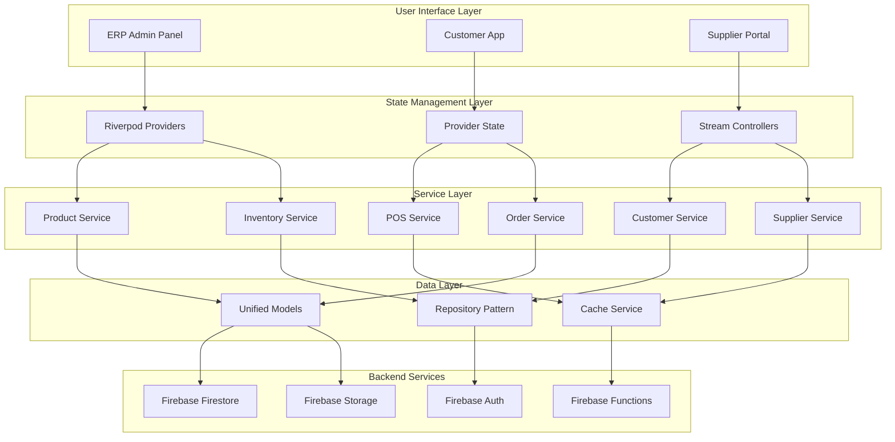

## 🏗️ Modular Architecture Flow

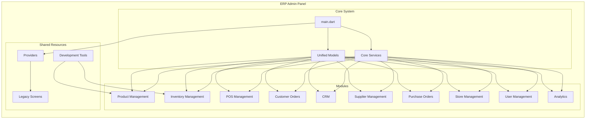

## 📱 Application Navigation Flow

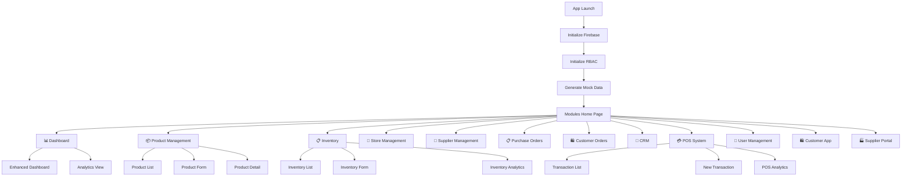

## 🔄 Data Flow Architecture

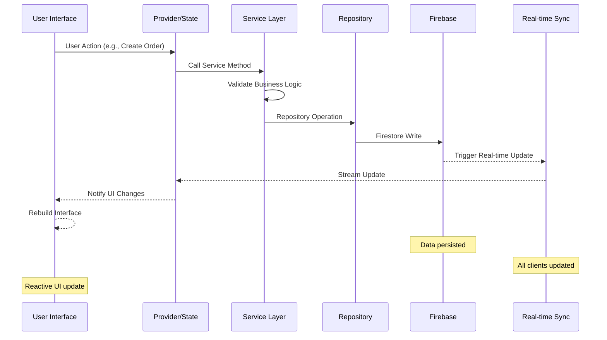

## 🏪 POS Module Flow Example

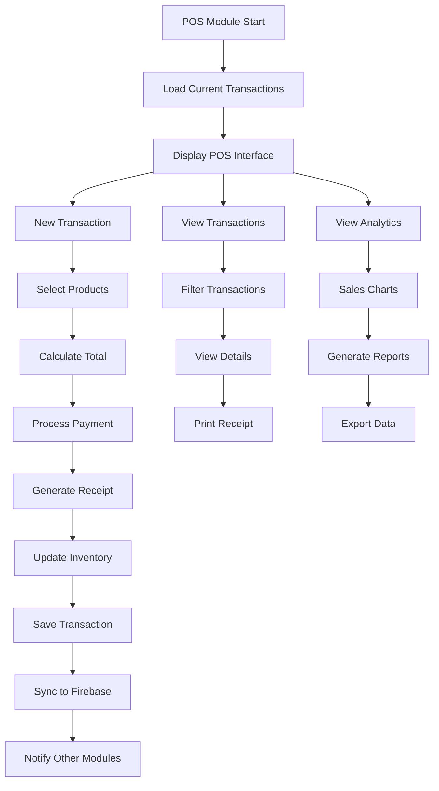

## 🛍️ Customer Order Processing Flow

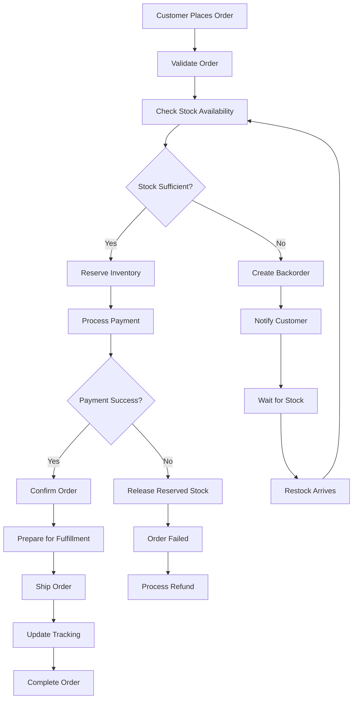

## 📊 Inventory Management Flow

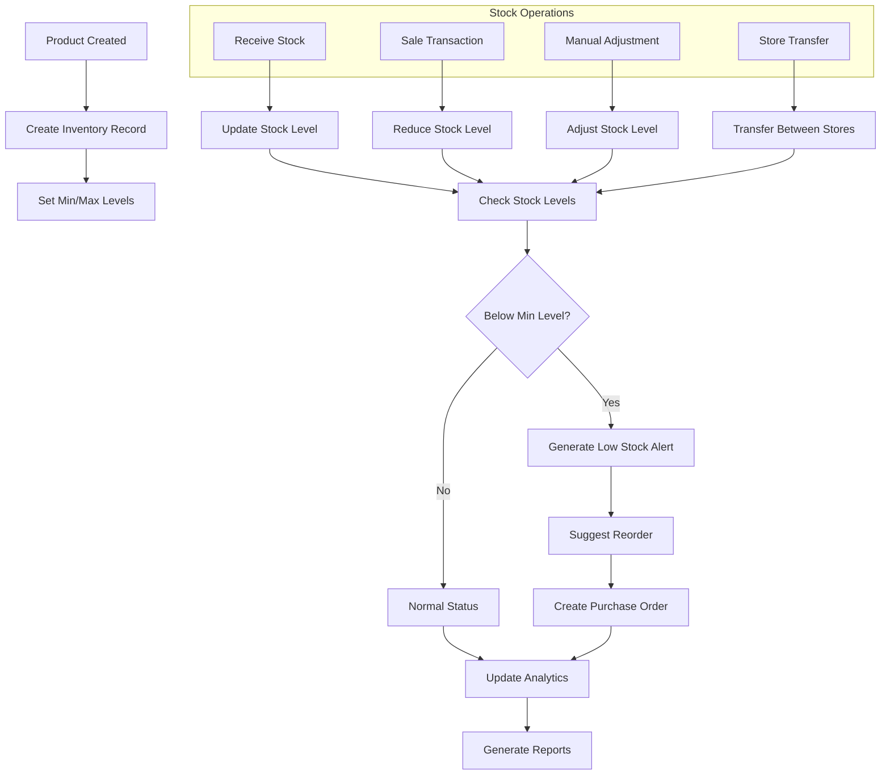

## 🔐 User Authentication & RBAC Flow

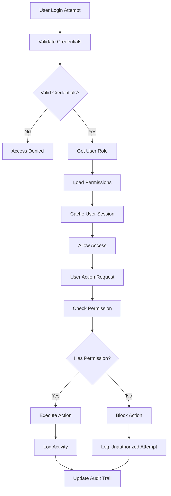

## 🔄 Inter-Module Communication

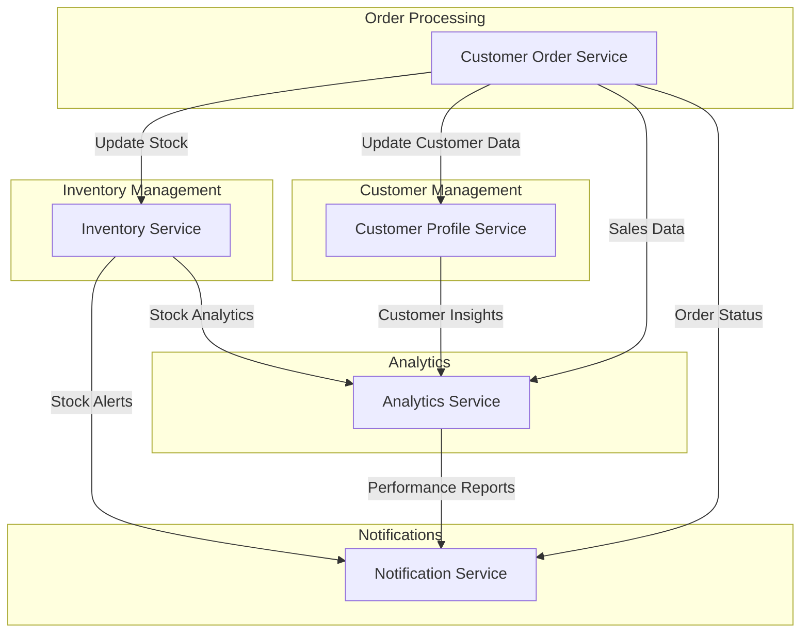

## 🏢 Multi-Store Architecture

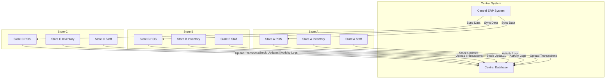

## 📱 Real-time Synchronization

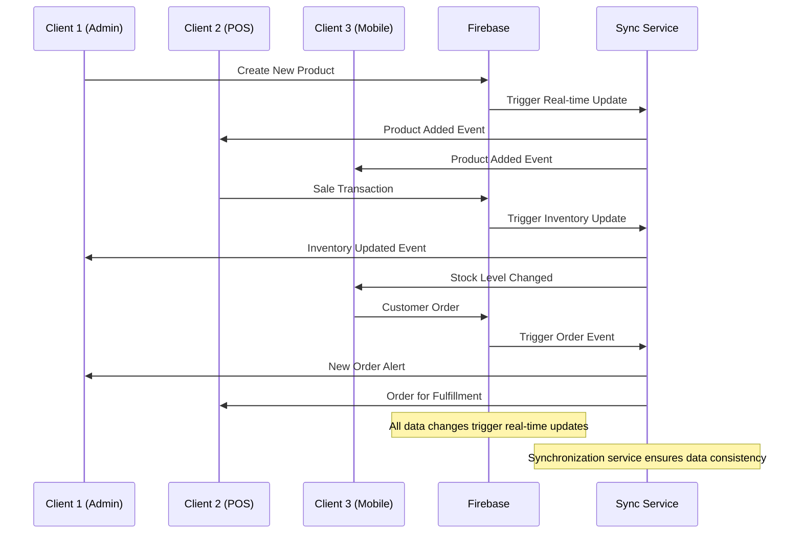

## 🔧 Development Workflow

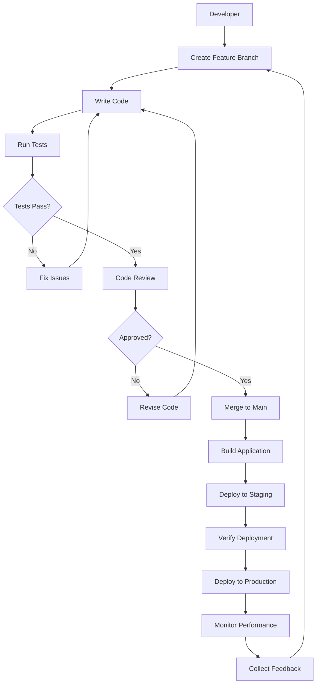

## 📊 Performance Monitoring Flow

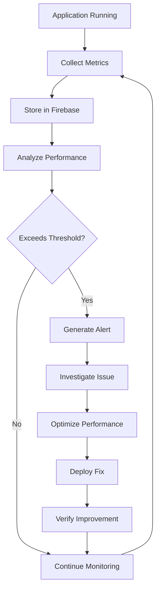

## 🎯 Error Handling Flow

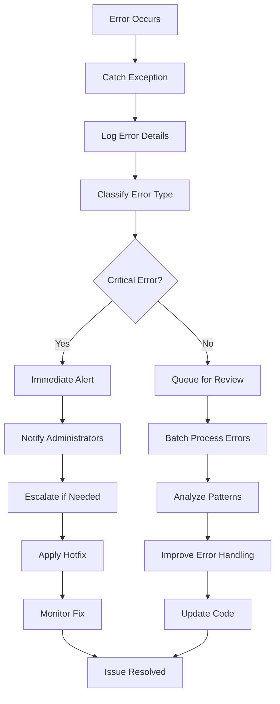

## 🔄 Data Migration Flow

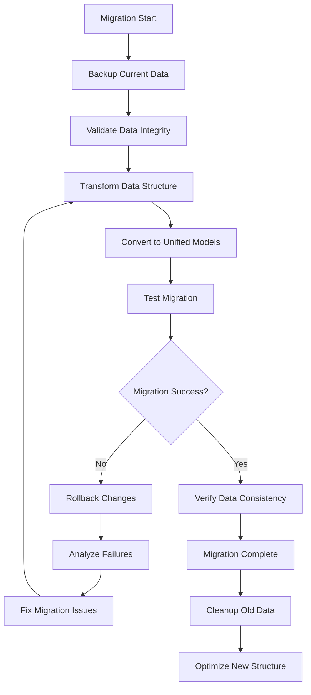

This comprehensive flowchart documentation shows how every component in the Ravali ERP system communicates, flows data, and maintains consistency across the entire ecosystem. Each diagram illustrates different aspects of the system architecture and operational flow.
